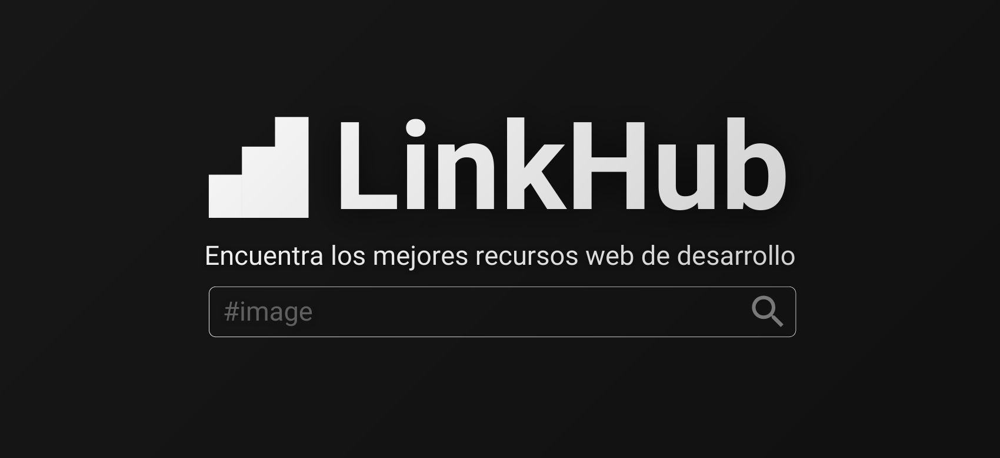

# LinkHub Project

LinkHub es una aplicación web de código abierto diseñada para permitir a los usuarios guardar, organizar y descubrir recursos web de manera eficiente. Inspirado en la necesidad de tener un lugar centralizado donde las personas puedan acceder a enlaces útiles recomendados por una comunidad, LinkHub busca simplificar la forma en que interactuamos con la información en línea.

<div align="center" style="max-width: 800px; height: 220px; margin: 0 auto; overflow: hidden;">
  
</div>

## 🚀 Despliegue

Visita [LinkHub](https://linkhub.doneber.dev) para ver la aplicación en acción.

## 📚 Stack de Tecnologías

Este proyecto utiliza un stack moderno y eficiente para proporcionar una experiencia de usuario excepcional y un desarrollo ágil:

- **[Astro.build](https://astro.build/)**: Un moderno generador de sitios estáticos que te permite construir interfaces de usuario rápidas y eficientes.
- **[Preact](https://preactjs.com/)**: Una alternativa ligera a [React](https://react.dev/) con la misma API moderna, permitiendo un rendimiento superior y tamaños de paquete más pequeños.
- **[TypeScript](https://www.typescriptlang.org/)**: TypeScript para tener nuestro javascript fuertemente tipado sea mas fácil escalarlo y mantenerlo.
- **[Tailwind](https://tailwindcss.com/)**: Un marco CSS de utilidad repleto de clases que se pueden componer para crear cualquier diseño, directamente en las etiquetas html.
- **[Nanostores](https://www.npmjs.com/package/nanostores)**: Un ligero manejador de estados. Utiliza muchos almacenes atómicos y manipulación directa.

**El diseño**

La idea del proyecto esta plasmanda en [este enlace de figma](https://www.figma.com/file/6P3FdnMHq6i2D3l80Hmmqn/LinkHub?type=design&node-id=0%3A1&mode=design&t=ipB1Ltt0fh4gDoiA-1). Sin embargo no algo oficial, la verdadera fuente de inspiración del estilo es [Notion](https://notion.so/)


## 🏗️ Configuración del Proyecto

### Requisitos Previos

Asegúrate de tener instalado Node.js en tu sistema para poder trabajar con Astro y Preact. Puedes descargarlo desde [nodejs.org](https://nodejs.org/).

### Instalación

Clona este repositorio en tu máquina local y navega al directorio del proyecto:

```bash
git clone https://github.com/doneber/linkhub
cd linkhub
```

Instala las dependencias del proyecto:

```bash
npm install
```

### Ejecutar en Desarrollo

Para iniciar el servidor de desarrollo y trabajar en mejoras:

```bash
npm run dev
```

Visita `http://localhost:4321` para ver tu proyecto en acción.

### Construir para Producción

Para construir tu proyecto para producción, ejecuta:

```bash
npm run build
```

## 🤝 Cómo Contribuir

Estamos encantados de recibir contribuciones de la comunidad. Para empezar:

1. Forkea el repositorio.
2. Crea una nueva rama para tus cambios (`git checkout -b feature/miNuevaCaracteristica`).
3. Haz tus cambios y commit (`git commit -am 'Añadiendo una nueva característica'`).
4. Push a la rama (`git push origin feature/miNuevaCaracteristica`).
5. Abre un Pull Request.

Consulta nuestro archivo [CONTRIBUTING.md](CONTRIBUTING.md) para más información sobre cómo contribuir al proyecto.

## 📜 Licencia

Este proyecto está licenciado bajo la Licencia MIT - vea el archivo [LICENSE.md](LICENSE.md) para detalles.

## 📢 Agradecimientos 🤝

¡Gracias a todos los contribuyentes!.

<a href="https://github.com/doneber/linkhub/graphs/contributors">
  
</a>
